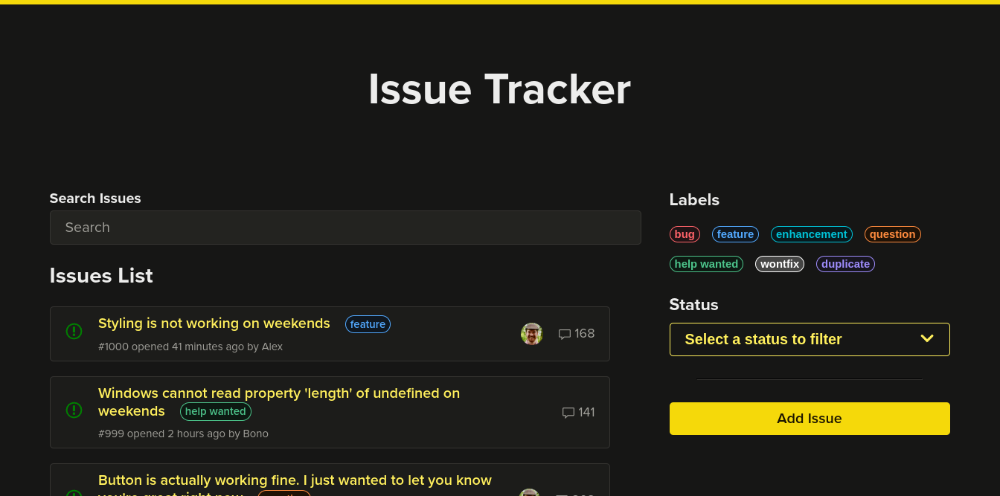

<h1 align="center">
  <a href="https://issue-tracker-rosy.vercel.app/">
    
  </a>
  <br />
</h1>

Track and manage bugs or issues within a project. Collaborate and organize the work that needs to be done and prioritize tasks. 

### Project purpose

- Learn [React Query](https://tanstack.com/query/latest)


### Getting Started

1. Clone the repo
    ```
    git clone git@github.com:joaom00/issue-tracker.git
    cd issue-tracker
    ```

2. Install dependencies
    ```
    npm install
    ```

3. Run initial setup
    ```
    npm run dev
    ```

Web will be running on port 3000
